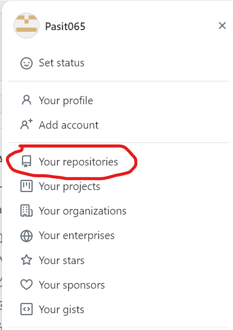
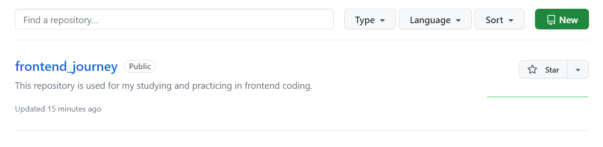

# Git repository.
Git repo is the storage that contain your projects file, which any users could collaborate and access them save some changes and update some project whatever they want.
## Create new local repository.
You can create your own repository in your local machine by following this procedure:
1.Create new directory or folder and name it.
2.Perform 'git init'.
3.Write some code.
4.Commit it.
## Create remote repo in Github.
You can create your own repository in Github if you want to collaborate update or make some changes with others then remote repo is necessary. First of all you will go to top right and select your account profile.


Then select 'new' to create remote repo.
 

Then set your information such as repository name and submit.
## Connect your local repo to remote repo.
You can connect your exist repo in local machine and then connect it to remote repo location to working with some changes such as 'git push'. First of all you will perform this command in your own local directory repo by this
```
git remote <remote_name> <remote_repo_url>
```
In the process above you will assign remote_repo_url by copy path in remote repo from github and assign remote_name, remote_name is used for determine remote endpoint name. Typically, we will use remote_name with 'origin'. You can change remote_name whatever you want by perform the command below in repo directory location:
```
git remote rename <old_name> <new_name>
``` 
## Delete branch.
You can delete your own branch by perform this:
```
git branch --delete <branch_name>
```
Please note that you can't delete required branch if you are in that branch now.
And you can see every branch in your project by:
```
git branch
```
After perform 'git branch --delete', remote repo aren't updated now. So 'git branch --delete' will only delete specific branch in your local repo, so you will update that to remote repo after that.But you can perform this:
```
git push origin --delete <old-branch>
```
This will delete  specific branch in remote repo immediately.


