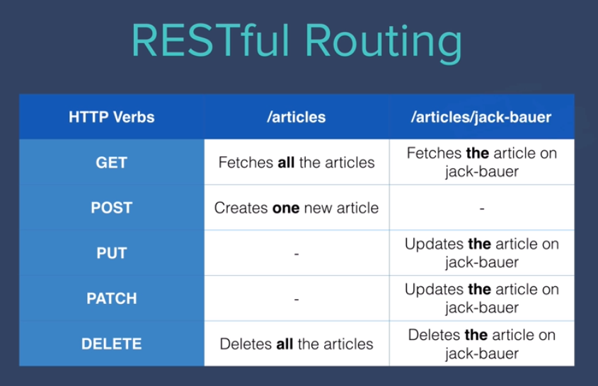

# RESTful Api

On day 33, we learnt about APIs and since then, we've used a number of public APIs. e.g ISS location, Trivia Questions and Twilio. In a lot of cases,
the API allows us to tap into a particular website's data or service.

Many companies have collected valuable data e.g. Bitcoin prices, Restaurant reviews and provide an API for developers to access this data for a price.
Depending on how valuable the data/service is behind the API, these APIs can charge anywhere from $9 to $99 per month for access. Some even charge per API call.

What if you have access to some information that other people might want to use? E.g. You collected data on all the cafes in a particular city 
and figured out which ones were suitable for remote-work? Then you could create an API and charge people to access your data.

But how do you create an API?

## What is REST (REpresentational State Transfer)
From what we have learnt, client send the request to the server using HTTP (Hyper Text Transfer Protocol), which is one the most common protocol.

But HTTP isn't only protocol we have for the client and server to communicate. You can compare protocols to languages we speak in our daily life, and HTTP is the English of the internet client-server world.

Below is another example protocol called FTP (File Transfer Protocol)

Imagine we go to the restaurant in Italy, if we speak Thai, the waiter won't understand us. The same goes for the server, if we, client, send wrong protocol, the server won't understand as well

REST is one of the architecural styles for designing API which is the most popular at the moment. What resemble REST are

1. Use HTTP Request verbs
- GET
- POST
- PATCH
- PUT
- DELETE

2. Use specific pattern of route/endpoint URL

## Related library you need to research
FLASK - Minimal framework to build API and web application https://flask.palletsprojects.com/en/2.3.x/quickstart/
SQLALCHEMY - Connect flask with database and provide way to query without SQL https://flask-sqlalchemy.palletsprojects.com/en/3.0.x/quickstart/