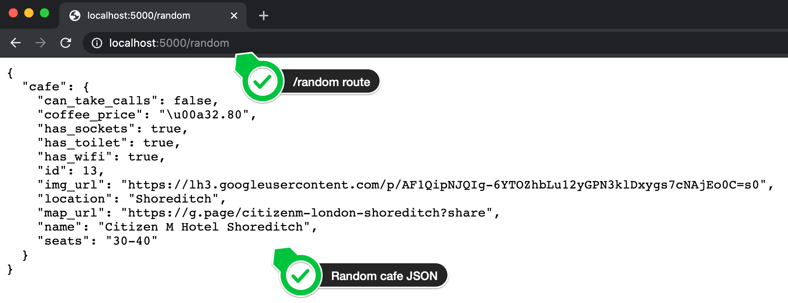
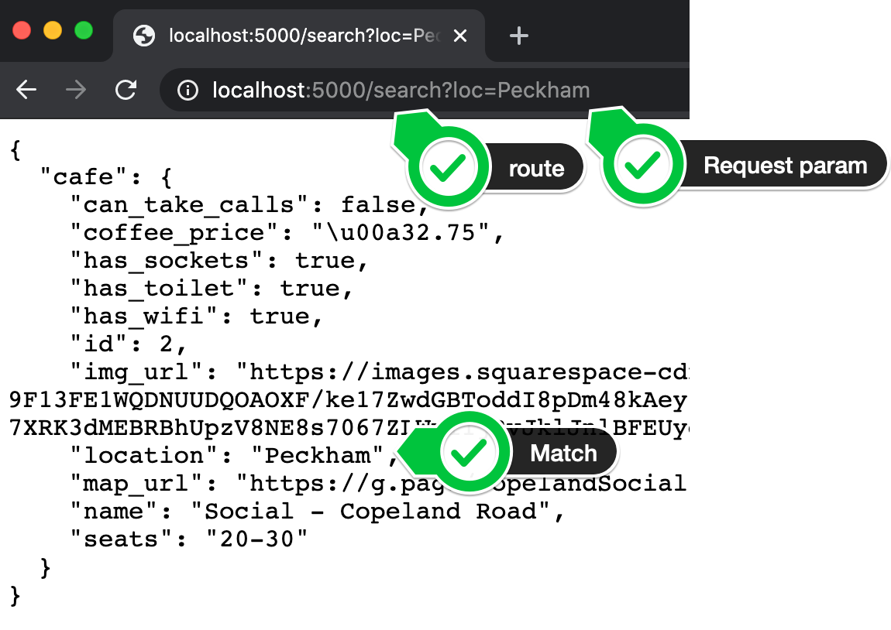
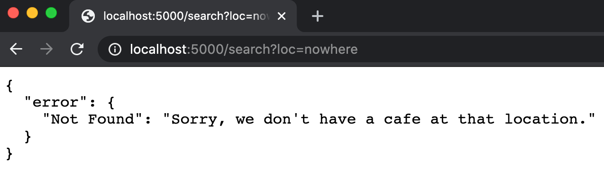

## HTTP GET - a Random cafe

HTTP GET - a Random Cafe
Given our database consists of a bunch of cafes to remote-work from, one of the likely use cases of our API is a developer who wants to serve up a random cafe for their user to go to. So let's create a /random route that serves up a random cafe.

you can checkout https://sqlitebrowser.org/ to learn how to take a look at .db file with GUI

1. Create a /random route in main.py that allows GET requests to be made to it.

2. When someone makes a GET request to the /random route, our Flask server should fetch a random cafe from our database.

NOTE: Don't worry about returning anything at the moment.

In order to do this, we have to turn our random_cafe SQLAlchemy Object into a JSON. This process is called serialization.

Flask has a serialisation helper method built-in called jsonify() . But we have to provide the structure of the JSON to return.

3. See if you can use [the documentation on jsonify()](https://www.adamsmith.haus/python/docs/flask.jsonify) to figure out how to get the /random route to work. If successful, this is what you should see when you run main.py and go to localhost:5000/random

The method described in the docs has maximum flexibility. It allows you to have perfect control over the JSON response. e.g. You could also structure the response by omitting some properties like id. You could also group the Boolean properties into a subsection called amenities.

But in most cases, you might just want to return all the data you have on a particular record and it would drive you crazy if you had to write out all that code for every route.

So another method of serialising our database row Object to JSON is by first converting it to a dictionary and then using jsonify() to convert the dictionary (which is very similar in structure to JSON) to a JSON.

### HTTP GET - All the Cafes
HTTP GET - All the Cafes
If someone was creating a website that lists all the cafes, then they would need to fetch all the cafes in our database.

e.g. https://laptopfriendly.co/london

CHALLENGE:

1. Create another GET route that's called /all

2. When a GET request is made to this /all route, your server should return all the cafes in your database as a JSON.

### HTTP GET - Find a Cafe
1. Create a /search route to search for cafes at a particular location.

If you look in the cafes.db, you can see the field location. This is the rough area where the café is located.

Make your API return all the cafes in a particular area.

The user will make a GET request to your /search route and pass the location (loc) as a parameter. Parameters are passed in the URL with a ?

If successful, this is what we should see:

And if the location the user passed as the parameter doesn't exist then this is what you should see:

The challenge here is how to select all the cafes that have a particular location.