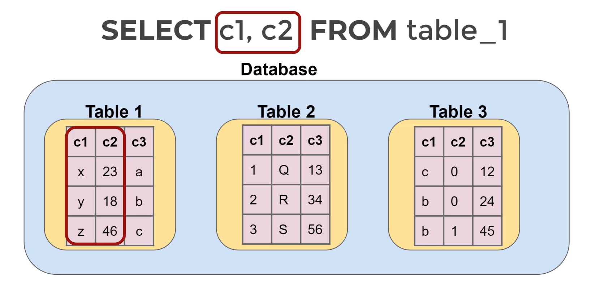
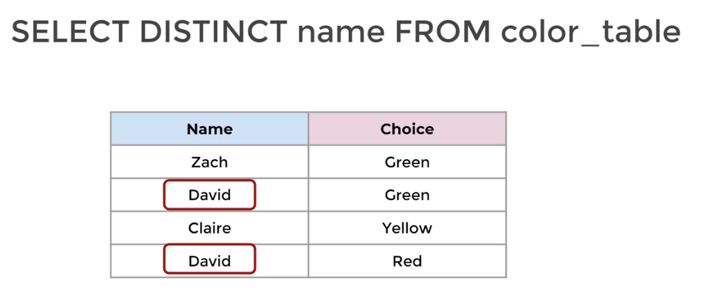

# SQL Fundamentals - Syntax

## SELECT statement
**SELECT** is the most common statement. It allows us to retrieve data from a table. We can combine **SELECT** with other statements to perform more complex queries.

Example: 

```SELECT column_name_1, column_name_2 FROM table_name```




### Challenge
We want to send out a promotional email to our existing customers. Use a **SELECT** statement to grab the first name, last name and email of every customer

### DISTINCT
Sometimes a table contains a column that has duplicate values and you might only want the unique/distinct value. You can use **DISTINCT** keyword to get only the distinct values in a column

Example: 

```SELECT DISTINCT column_name_1 FROM table_name```
