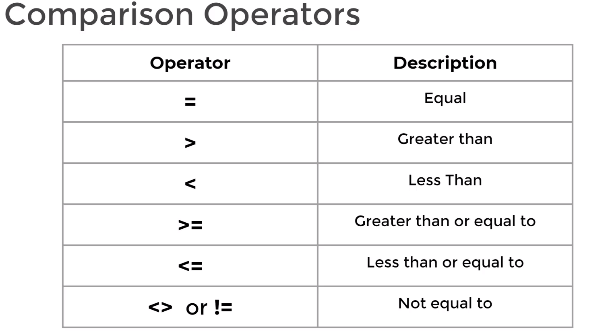
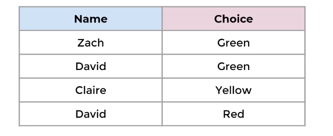
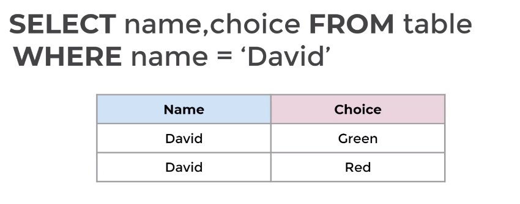
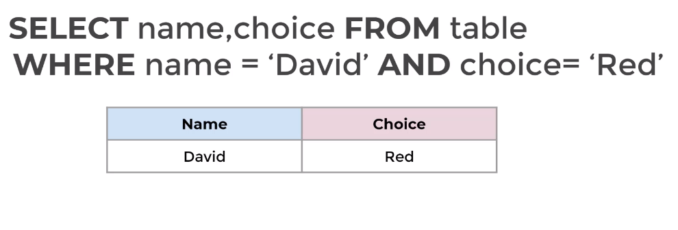

# SQL Fundamentals - Syntax

## WHERE statement
**WHERE** is another the most common SQL statement. It allows us specify conditions on columns for the rows to be returned


```
SELECT column_name_1, column_name_2 
FROM table_name
WHERE conditions;
```

- The WHERE clause appears immediately after the FROM clause of the SELECT statement
- The conditions are used to filter the rows returned from the select statement
    - Comparison Operators
        - is `price` greater than 3 USD?
        - is the customer's `first name` "David"?

    - Logical Operators - Allow us to combine multiple comparison operators
        - `AND`, `OR`, `NOT`

#### Example usage



