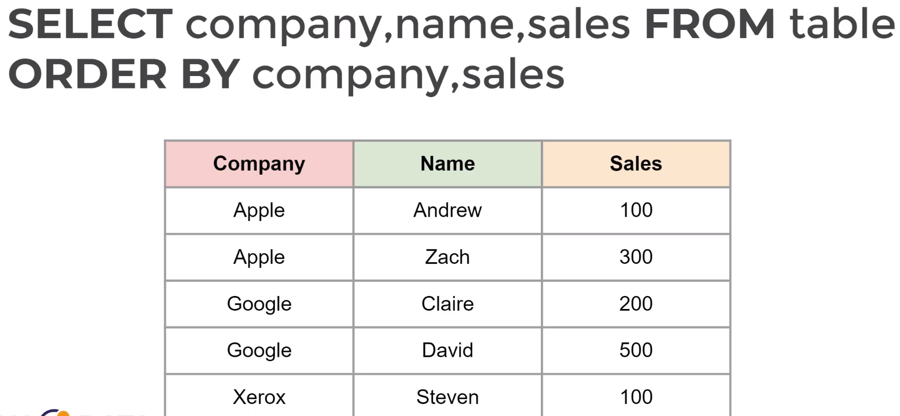

# SQL Fundamentals - Syntax

## ORDER BY statement
**ORDER BY** is used to sort the rows based on a column value, in either ascending or descending order. We need to use **ORDER BY** after **SELECT** and **WHERE** 

```
จัดประเภทเเถวโดยพิจารณาค่าตาม col ที่กำหนดโดยการจัดกลุ่มให้เเถวที่มีค่า ใน col เหมือนกันอยู่ติดกันเป็นกลุ่มเเละเรียงเเถวจาก ค่า น้อยไปมาก
```

Example: 

```
SELECT column_1, column_2
FROM table_name
ORDER BY column_1 ASC

SELECT column_1, column_2
FROM table_name
WHERE column_1 = 'x'
ORDER BY column_1 ASC, column_2 DESC
```



### LIMIT
**LIMIT** allows us to limit the number of rows returned for a query. This goes at the very end of the query

Example: 

```
SELECT column_1, column_2
FROM table_name
ORDER BY column_1 ASC
LIMIT 10
```

### Challenge
- We want to reward our top 10 paying customers. What are the customer id of them?

```
SELECT customer_id
FROM payment

ORDER BY amount DESC
LIMIT 10

```
- Customers want to rent a video to rent for the lunch.What are the titles of the 5 shortest length movies?

```
SELECT length,title
FROM film

ORDER BY length ASC
LIMIT 5

```