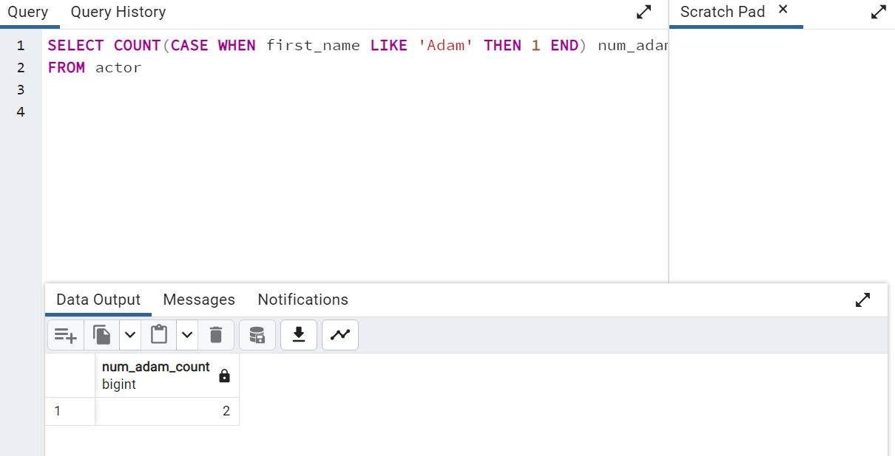

# SQL Fundamentals - Syntax

## BETWEEN statement
**BETWEEN** operator can be used to match a value against a range of values. These two are the same 

```
column >= low_value AND column <= high_value
column between low_value and high_value
```

We can also combined **BETWEEN** with **NOT**

```
column NOT BETWEEN low_value AND high_value
```

Lastly, BETWEEN can also apply with dates but you need to format to YYYY-MM-DD format and timestamp also matters
Example: 

```
SELECT *
FROM payment
WHERE payment_date BETWEEN '2007-02-01' AND '2007-02-14'
```

## IN statement
**IN** operator can be used to check multiple values.

```
value IN (value_1, value_2)
```

Lastly, BETWEEN can also apply with dates but you need to format to YYYY-MM-DD format and timestamp also matters
Example: 

```
SELECT color
FROM color_table
WHERE color IN ('red', 'green')
```

### Challenge
research on LIKE and ILIKE statements

# LIKE statements
LIKE is the statement that will filter the pattern of string in selected column and matching or getting the row that are the same as LIKE statement have determined.

The keyword pattern will be sign:

--> '_' is defined of character
--> '%' is defined of the group characters

## For example:

'%a_' ---> This is the group of characters that before 'a' are the group of strings
            and 'a' is in the position before the final character
            like 'Sqyas': 'Sqy' is '%' , s is '_'

```
SELECT col_1
FROM table_1

where col_1 like '%a_'

```

You can combined COUNT statement with LIKE statement to which will filter the amount of values that you determined in LIKE condition (So this will work with SELECT statement)



As you have seen from code above in this code

- Count statement will working with 'CASE WHEN first_name LIKE 'Adam' THEN 1 END'
  which means you are select first_name and matching every element in column 'first_name' so if any row is match with 'Adam' then it will return 1 but if that
  row is not match with that, so it will return 'Null' instead. and when the counting is finish in sql display will shown the table named 'num_adam_count'
  and that table will shown the amount of 'Adam' from COUNT statement.

# ILIKE statement
ILIKE statement is working similar with LIKE statement but ILIKE is be used for matching which independent of lowercase or uppercase

## For example
```
'Table' LIKE 'Ta%' it will return True.
'Table' LIKE 'ta%' it will return False.
```
but in this case we will use ILIKE:
```
'Table' ILIKE 'Ta%' it will return True.
'Table' ILIKE 'ta%' it will return True.
```
As you seen ILIKE statement is insensitive case of LIKE statement.