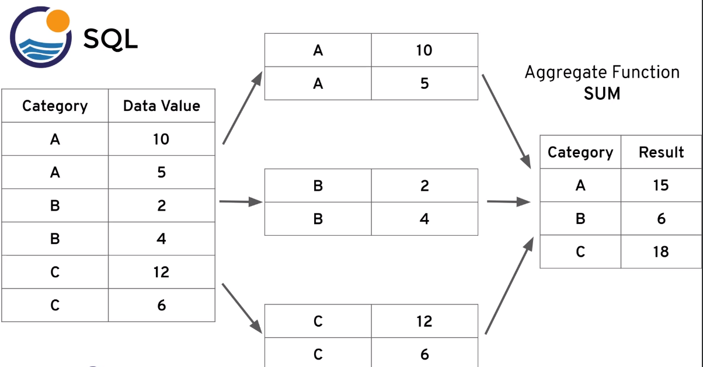

# SQL Aggregation

## GROUP BY statement
- **GROUP BY** statement will allow us to aggregate data and apply aggregate functions per category
- **GROUP BY** must be right after FROM or WHERE statement

- If we have group by, in **SELECT** statement, columns must either get wrapped by aggregate function or be in the **GROUP BY** call
```
SELECT category_col, AGGREGATE_FUNCTION(data_col)
FROM table
GROUP BY category_col

SELECT category_col, AGGREGATE_FUNCTION(data_col)
FROM table
WHERE category_col != 'A'
GROUP BY category_col
```

- Categorical column is a column we choose to be a category and in the **GROUP BY** call, in below example image the categorical column is `category`


- We can have more than 1 categorical columns
```
SELECT category_col_1, category_col_2, AGGREGATE_FUNCTION(data_col)
FROM table
GROUP BY category_col_1, category_col_2
```

- WHERE statements should not be use on aggregation results, we will learn to use HAVING to apply filter on those results later

## GROUP BY Challenge
- We have two staff members, with staff IDs 1 and 2. We want to give a bonus to the staff member that handled the most payments. Most in terms of number of payments processed, not total dollar amount. How many payments did each staff member handle and who gets the bonus?
    - use the payment table
- Corporate HQ is conducting a study on the relationship between replacement cost and a movie MPAA rating (e.g. G, PG, R, etc.) What is the average replacement cost per MPAA rating?
    - use the film table
- We are running a promotion to reward our top 5 customers with coupons. What are the customer ids of the top 5 customers by total spend?
    - use the payment table
    - use order by