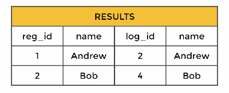

# SQL JOIN

## AS
- **AS** statement allow us to create an alias for a column or result

Example

```
SELECT count(*) as transaction_count, sum(amount) as total_amount
FROM table
```

- **AS** operator gets executed at the very end of the query which means that we can't use the alias inside a where operator


## JOIN
- **JOIN** allow us to combine multiple tables together
- There are several types of joining but we will start with **INNER JOIN**
- **INNER JOIN**
Example: 

```
SELECT *
FROM table_a
INNER JOIN table_b
    ON table_a.match_column = table_b.match_column
```




- If you see just **JOIN** withour INNER, PostgreSQL will treat it as an **INNER JOIN**

Try this in pgAdmin
```
SELECT payment.customer_id, customer.first_name, payment.payment_id
FROM payment
INNER JOIN customer
    ON payment.customer_id = customer.customer_id
```

- Explained with Venn Diagrams [https://blog.codinghorror.com/a-visual-explanation-of-sql-joins/]