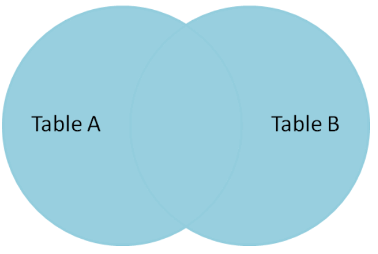
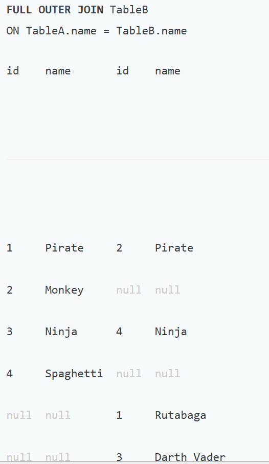
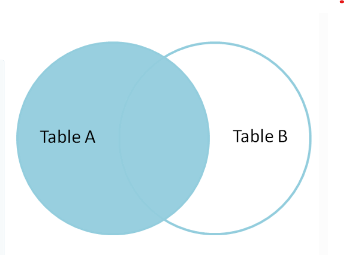
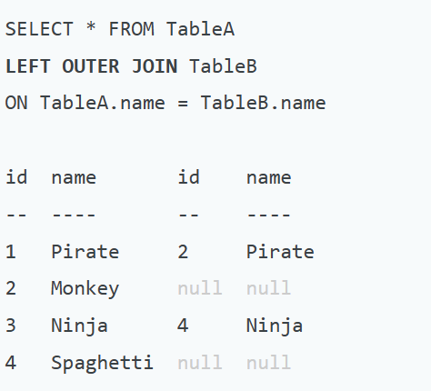
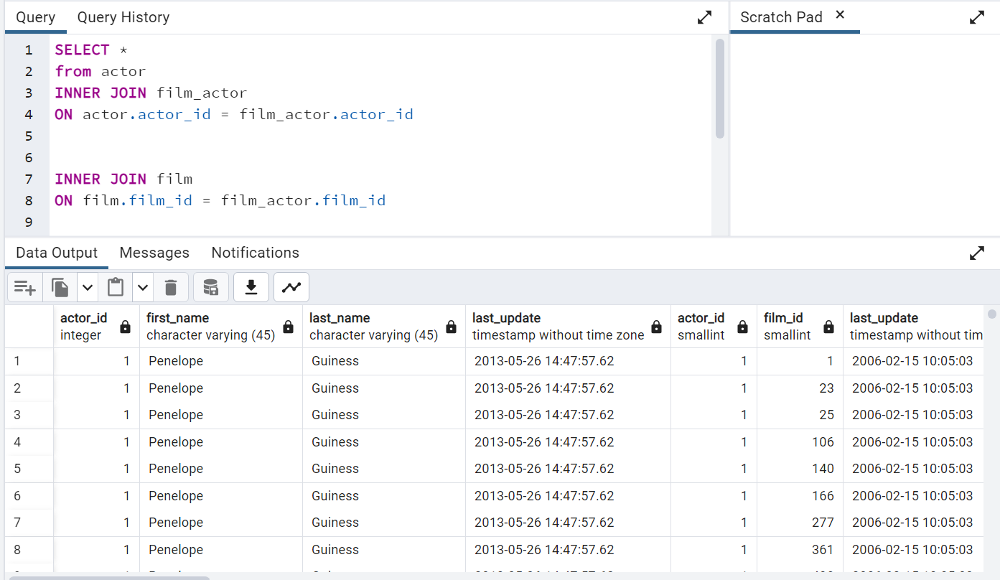

# Research on following other types of join
The type of join statements is seperated by set principle.

## 1. FULL OUTER JOIN
Full outer join is the one of categories of join statement that will allows
you to join two table with every case that will possible in table.(Its can be described as union in set)

From the picture above if each row that have only value1 in table A but there are no value1 in table B the output of the row that have that value will be table A:value1, table B:null.But if that row also have value either table A and table B that will be table A:value2, table 
### For instance



## 2. LEFT JOIN
Left join is another part of outer join that will allow you to get the row that will have left column value, its not independent on right column value its only consider left value(The left value col in the row that you will get will never been null)
### For instance


## 3. RIGHT JOIN
Right join is another part of outer join that will allow you to get the row that will have right value, its not independent on left column value, So right and left join is the opposite case from each other.(The right value col in the row that you will get will never been null)
## Multiple tables join

As you seen from this above code you can join more than two tables each other 
```
SELECT *
from first_table
INNER JOIN second_table
ON first_table.column_1 = second_table.column_1

INNER JOIN third_table
ON second_table.column_2  = third_table.column_2
```
So from the code above the result that you have got is the table that combined three tables and you can select every column from those three tables except the repeat table that in each two tables.
