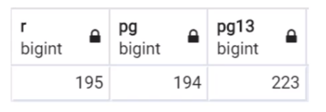

# SQL CONDITIONAL EXPRESSION

## CASE
- **CASE** statement allow us to get columns based on our conditions, which is similar to IF/ELSE statement in programming languages

Example

```
SELECT CASE
        WHEN condition1 THEN result1
        WHEN condition2 THEN result2
        ELSE other_result
       END
FROM table


SELECT a,
       CASE
          WHEN a = 1 THEN 'one'
          WHEN a = 2 THEN 'two'
          ELSE 'unknown'
       END AS string_name
FROM table


SELECT customer_id
       ,CASE
          WHEN customer_id <= 100 THEN 'Premium'
          WHEN customer_id BETWEEN 100 and 200 THEN 'PLUS'
          ELSE 'Normal'
        END AS customer_status
FROM customer
```

You can use more than one column to compare with when statement
```
SELECT CASE
       WHEN col_1 <= 3 THEN 'case_1' 
       WHEN col_2 LIKE '%P% THEN 'case_2'
       ELSE 'case_3'
       END AS case
FROM table_1
```
From the statement above this will check table_1 from row by row. For each row sql will check for col_1 that will lower than 3 or not, if not then sql will check col_2 from the same row.
## CASE Challenge
- We want to know and compare the various amounts of films we have per movie rating
- use CASE and the dvdrental database to re-create this table below




```
SELECT COUNT(CASE WHEN df.rating = 'R' THEN 1 END) R, 
	COUNT(CASE WHEN df.rating = 'PG' THEN 1 END) PG, 
	COUNT(CASE WHEN df.rating = 'PG-13' THEN 1 END) PG13
FROM (SELECT DISTINCT title, rating
FROM film) df
```
